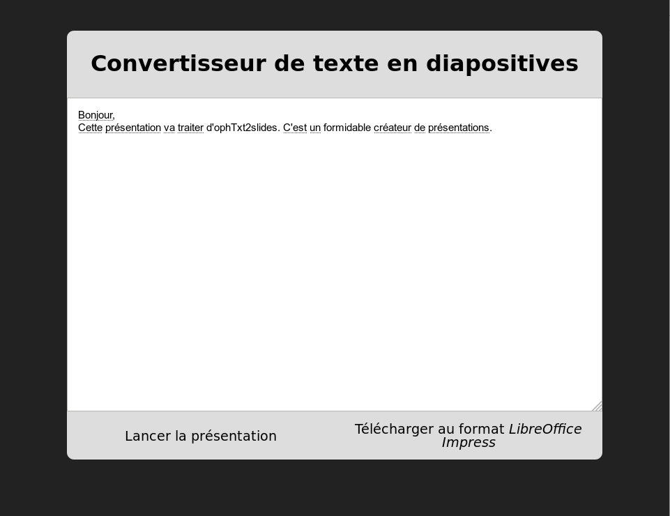

# ophTxt2slides

ophTxt2slides is a small web application that converts a text document to a slideshow, creating one slide per sentance in the document.

It is [available online here](https://lovasoa.github.io/ophTxt2slides/), without having to download anything.

You just copy and paste your text in the application (from a Word or LibreOffice document, for instance), and click a buton to launch the slideshow.

